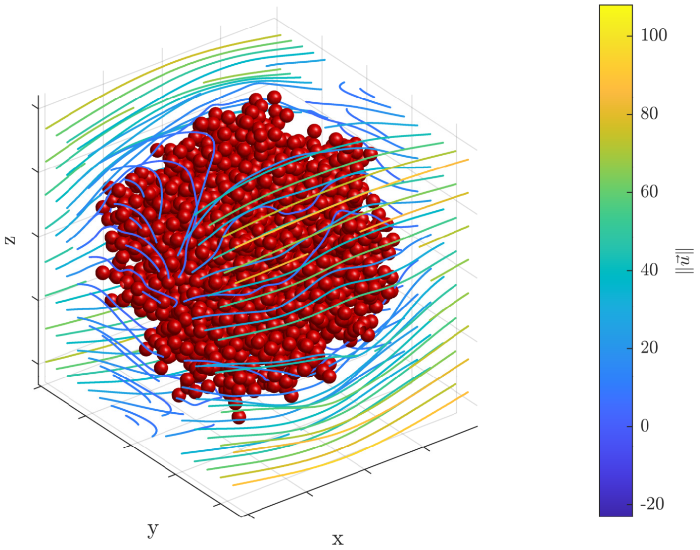

# StokesMFS3D

**StokesMFS3D** provides a minimal working implementation of the **Method of Fundamental Solutions (MFS)** for solving the **Stokes resistance** and **mobility problems** for spherical rigid bodies.

This code demonstrates the basic algorithm using source points on proxy surfaces only. 

> **Note**: The advanced image enhancement technique presented in [Broms et al. (2024)](#publications) is *not yet included* in this version. It is therefore recommended to use a sufficiently large separation parameter `delta` between particles to ensure numerical accuracy.

## Features

- Solves Stokes mobility and resistance problems via MFS coupled to the fast multipole method (FMM).
- Demonstrates the method using minimal input (`demo.m`)
- For mobility, the number of GMRES iterations is constant for a growing number of particles, P, and the algorithm is therefore linear in P.

## Prerequisites

To run simulations effectively, ensure the following dependencies are available:

- **[FMM3D](https://github.com/flatironinstitute/FMM3D)**  
  Recommended for accelerating calculations with many particles (typically >40 with default settings)

- **[Stokes_Direct](https://github.com/annabroms/Stokes_Direct)**  
  Used for direct evaluation of fundamental solutions.  
  Only `SE0P_Stokeslet_direct.c` needs to be compiled. A precompiled binary is included in the `Stokes_Direct` folder.

- **Spherical Design Nodes**  
  Used to construct the source/target geometry. See `geometry/README.md` for details.

## Example

Run `demo.m` to reproduce a basic simulation for spherical particles using the MFS.

## Publications

This work is based on the following research papers:

1. **Accurate close interactions of Stokes spheres using lubrication-adapted image systems**  
   *A. Broms, A.H. Barnett, A.-K. Tornberg*, J. Comput. Phys. (2024)  
   [https://doi.org/10.1016/j.jcp.2024.113636](https://doi.org/10.1016/j.jcp.2024.113636)

2. **A Method of Fundamental Solutions for Large-Scale 3D Elastance and Mobility Problems**  
   *A. Broms, A.H. Barnett, A.-K. Tornberg*, to appear in *Adv. Comput. Math.* (2025)  
   [https://arxiv.org/abs/2409.04215](https://arxiv.org/abs/2409.04215)

## Roadmap

Planned additions include:

- Lubrication-based image enhancement (as in [1])
- Support for ellipsoidal particle geometries

